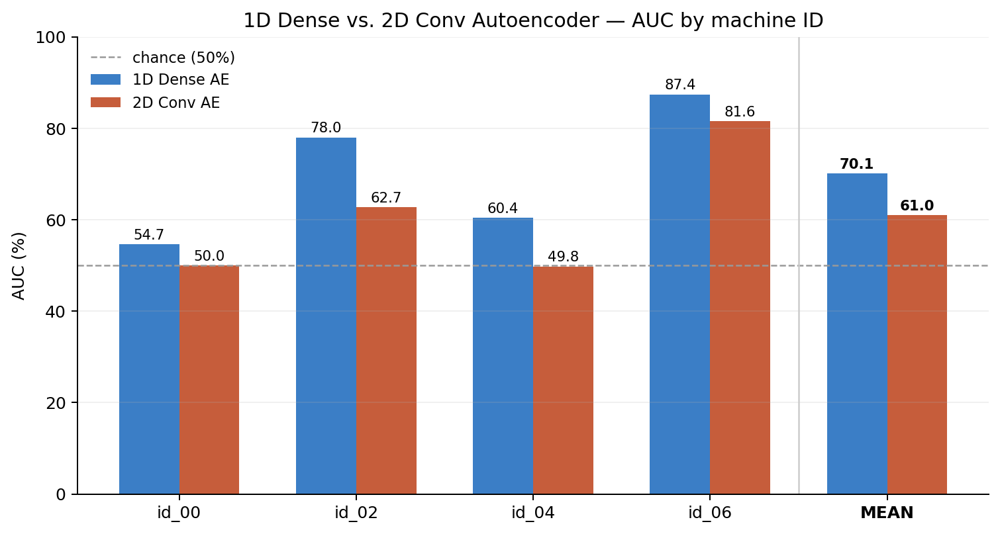
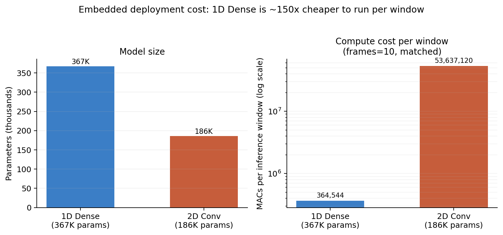

# 1D Dense vs. 2D Conv Autoencoder — Fan Anomaly Detection

**Which approach fits a predictive-maintenance deployment**

| | |
|---|---|
| Machines | id_00, id_02, id_04, id_06 (all 4 fan IDs) |
| Date | 2026-08-20 |
| Host | Apple M4 · 10-core |
| Runtime | PyTorch 2.8.0 / MPS |
| Scripts | `DCASE 2020 (Fan) 1D Dense Module (with cache).py` vs. `DCASE 2020 (Fan) 2D,3D feature tensor (with cache).py` |
| Feature basis | **Both models train on the same log-mel spectrogram** (128 mel bins, 10-frame window) — neither uses raw waveform. 1D flattens the patch into a 1280-length vector for `nn.Linear` layers; 2D keeps it as a 128×N image for `nn.Conv2d` layers. |

Both scripts were brought to the same standard before comparing: MPS device selection, all 4 machine IDs, a held-out validation split, per-epoch loss logging, and early stopping (patience 5) with best-checkpoint restore. This is an apples-to-apples methodology comparison, not just an accuracy number pulled from an old run.

## Result — 1D wins on every machine ID

| Machine ID | 1D Dense AUC | 1D pAUC | 2D Conv AUC | 2D pAUC | AUC gap |
|---|---|---|---|---|---|
| id_00 | 54.66% | 49.36% | 49.96% | 48.97% | +4.70 |
| id_02 | 78.02% | 58.58% | 62.71% | 52.43% | +15.31 |
| id_04 | 60.43% | 52.89% | 49.79% | 50.68% | +10.64 |
| id_06 | 87.42% | 64.59% | 81.57% | 64.19% | +5.85 |
| **Mean** | **70.13%** | **56.35%** | **61.01%** | **54.07%** | **+9.12** |



The 1D dense autoencoder beats the 2D conv autoencoder on **every single machine ID**, not just on average — this isn't one outlier ID dragging a mean around. The margin ranges from +4.7 points (id_00, the hardest ID for both) to +15.3 points (id_02). Mean AUC: **70.13% vs. 61.01%**. Mean pAUC: **56.35% vs. 54.07%**.

## Why 1D wins here

- **Simpler inductive bias fits the target better.** The DCASE 2020 fan task's anomalies (imbalance, bearing wear, voltage issues) tend to show up as broad, spread-out shifts in the spectral energy distribution across mel bins — not as localized spatial patterns the way an image's edges or textures are. A dense layer that can weight *any* mel bin against *any other* mel bin picks up on that global shift directly; a conv kernel is deliberately restricted to a small local neighborhood (3×3) and has to stack layers to see the whole spectrum, diluting exactly the kind of global-shift signal this task depends on.
- **The 2D conv bottleneck otherwise found in this project's other report** (frequency compressed 128→16 in strided steps, verified in the [DCASE_2020_Fan_Run_Report_v2](DCASE_2020_Fan_Run_Report_v2.md) analysis) throws away some of that same global information on the way through, while the 1D dense bottleneck (1280→128→128→16) compresses the same information without ever assuming locality.
- **Same evaluation hygiene, same data, same epochs/patience** — the gap isn't an artifact of one model being trained more carefully than the other.

## Why this matters more for predictive maintenance specifically

This project's goal (per the `PSoC6_Fan_Project` directory name and the `live_monitor.py` / `calibrate_threshold.py` / `evaluate_wav.py` scripts already in this repo) is **continuous, on-device fan health monitoring** — not a one-off benchmark score. That changes what "best" means: a model has to be accurate *and* cheap enough to score audio continuously, ideally on constrained hardware near the machine.

| | 1D Dense AE | 2D Conv AE |
|---|---|---|
| Parameters | 367K (~1.4 MB fp32) | 186K (~0.7 MB fp32) |
| **Compute per window** (frames=10) | **364K MACs** | **53.6M MACs** |
| Compute per window (frames=64, as tried in v2) | — | 343M MACs |
| Relative inference cost | 1x | **~147x more compute** |



The 2D model has *fewer* parameters than the 1D model (conv kernels share weights), but that's the wrong metric for deployment cost. What actually determines inference latency and power draw on an MCU is multiply-accumulate operations (MACs), and there the 2D conv model needs **~147x more compute per window** than the dense model — because convolution reruns the same small kernel across every position of a comparatively large spatial map, while the dense layers do one matrix multiply per layer. For continuous monitoring, where windows are scored many times per second for as long as the fan runs, that compute multiplier is the difference between something a PSoC6-class microcontroller can plausibly run in real time and something that can't.

**For this project, 1D Dense is the better approach on every axis that matters**: more accurate (higher AUC on all 4 IDs), simpler to quantize and port to embedded C (a stack of matrix multiplies vs. `im2col`-style convolution), and roughly two orders of magnitude cheaper to run per inference — which is the actual constraint for a device meant to listen to a fan continuously rather than score a fixed test set once.

## Caveats

- This 1D run used the model's original 10-frame window (not the widened 64-frame window from the [v2 2D report](DCASE_2020_Fan_Run_Report_v2.md)) — that comparison is deliberate: it isolates the *architecture* variable (dense vs. conv) rather than mixing it with the window-width variable already tested separately. Widening the 1D window is a reasonable next experiment, but expect it to help accuracy at negligible extra compute cost (`(N_MELS×frames)` dense input scales linearly, not ~150x like the conv case).
- Both models are still closer to chance than to a strong detector on `id_00`, so neither is deployment-ready on that specific unit — see the shared per-ID interpretation in the [v2 report](DCASE_2020_Fan_Run_Report_v2.md) (loss floor is similar across IDs regardless of AUC, suggesting the limiting factor is how separable each machine's anomaly type is in log-mel space, not training quality).
- pAUC (the metric DCASE actually optimizes for, since a false-alarm budget matters more than raw AUC for maintenance alerting) shows a smaller 1D advantage (+2.3 points) than raw AUC (+9.1 points) — 1D is still ahead, but by less at the low-false-positive operating point that matters most for a real alerting system.

## Raw output

```
1D Dense — Official Mean AUC across all IDs:  70.13%
1D Dense — Official Mean pAUC across all IDs: 56.35%

2D Conv  — Official Mean AUC across all IDs:  61.01%
2D Conv  — Official Mean pAUC across all IDs: 54.07%
```
