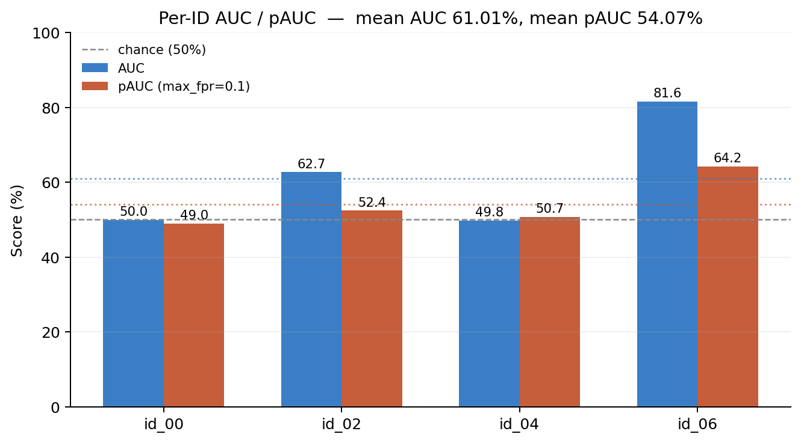
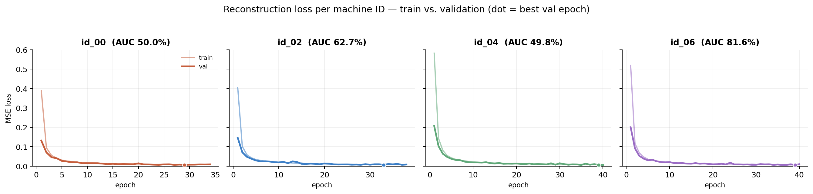

# DCASE 2020 Task 2 — Fan, 2D Conv Autoencoder

**Run report v2 — widened window + multi-ID + validation split**

| | |
|---|---|
| Machines | id_00, id_02, id_04, id_06 (all 4 fan IDs) |
| Date | 2026-08-20 |
| Host | Apple M4 · 10-core · 16 GB unified memory |
| Runtime | PyTorch 2.8.0 / MPS |
| Script | `DCASE 2020 (Fan) 2D,3D feature tensor (with cache).py` |
| Dataset | `DCASE2020/fan/train` + `/test` (full 4-ID set, 3675 train / 1875 test files) |

This is a follow-up to the [v1 report](DCASE_2020_Fan_Run_Report_v1.md), which trained only `id_00` with a 10-frame window and no validation visibility. Three changes went in for this run:

1. **Widened the time window** — 10 → 64 frames (~0.32s → ~2.05s of context), with a stride of 8 between windows to keep the cache/RAM footprint bounded (a dense stride-1 walk at 64 frames would have needed ~7.5 GB per machine ID; strided, it's ~1 GB).
2. **All four machine IDs** — the script only ever pointed at `id_00`'s folder; it now loops `id_00`/`id_02`/`id_04`/`id_06` against the full `DCASE2020/fan` source (the `PSoC6_Fan_Project` folder it used before only had `id_00` populated).
3. **Validation split + early stopping** — 10% of each ID's training windows are held out, per-epoch train/val loss is logged, and training stops (patience 5) once val loss stops improving, with the best-val checkpoint restored before scoring.

## Result

| Machine ID | AUC | pAUC (max_fpr=0.1) | Epochs run | Best val loss |
|---|---|---|---|---|
| id_00 | 49.96% | 48.97% | 34 (early-stopped) | 0.0060 |
| id_02 | **62.71%** | 52.43% | 38 (early-stopped) | 0.0060 |
| id_04 | 49.79% | 50.68% | 40 (full budget) | 0.0058 |
| id_06 | **81.57%** | **64.19%** | 40 (full budget) | 0.0054 |
| **Mean** | **61.01%** | **54.07%** | | |



The mean moved from **53.25% → 61.01%** AUC versus the original single-ID run, but that's driven almost entirely by `id_06` (81.57%) and, to a lesser extent, `id_02` (62.71%). `id_00` and `id_04` are still sitting right at chance (49.79–49.96%) despite the wider window, more data, and proper validation tracking — three of the four levers from the previous report's "next steps" list.

## Loss curves



All four IDs show the same healthy shape: validation loss tracks training loss closely with no divergence (no overfitting), converging to roughly the same reconstruction error (~0.0054–0.0060) regardless of final AUC. That convergence-to-similar-loss-but-different-AUC pattern is the key finding below.

## Interpretation

**The reconstruction loss floor is nearly identical across all four IDs (0.0054–0.0060), but the resulting AUC ranges from 49.8% to 81.6%.** That decouples "how well the autoencoder learned to reconstruct normal sound" from "how well reconstruction error separates anomalies" — the model is training correctly in all four cases; the separability of anomalous vs. normal reconstruction error is a property of each machine's acoustic signature, not of training quality.

This points away from the fixes already tried (window width, data volume, training hygiene) and toward:

- **id_00 and id_04's anomalies may simply look more like normal operation in log-mel space** for this fan unit than id_02/id_06's anomalies do — some MIMII fan units have anomaly types (e.g. subtle bearing wear) that produce smaller spectral deviations than others (e.g. voltage/unbalance faults), which is a known pattern in the DCASE 2020 fan subset.
- **A single shared architecture and threshold-free MSE score may not suit every ID equally.** id_06 and id_02 benefiting far more than id_00/id_04 suggests per-ID normalization or scoring (e.g. per-ID score calibration, or a per-ID anomaly threshold rather than raw MSE) could help the weaker IDs without hurting the stronger ones.
- **The bottleneck compression (128→16 on the mel axis) is still unchanged from the first report** — worth testing next now that window width and data hygiene are ruled out as the dominant factor.

## Next steps

1. **Inspect id_00 and id_04 reconstructions directly** — plot a few normal vs. anomalous log-mel patches and their reconstructions side by side to see whether the anomaly signal is visually present but not separable by MSE, or genuinely absent at this feature resolution.
2. **Try per-ID score normalization** (e.g. z-score the anomaly scores using each ID's own validation-set MSE distribution) before computing AUC — this is a common DCASE trick and costs no retraining.
3. **Loosen the frequency bottleneck** (e.g. stop downsampling at 32 mel-bins instead of 16, or add a 4th encoder stage instead) now that the window-width and data-volume variables are controlled for.
4. **Compare against the 1D baseline's per-ID breakdown** (its cache already exists at `DCASE2020/fan/cache/`) to see whether id_00/id_04 are hard for that architecture too, or whether this is specific to the 2D conv approach.

## Raw output

```
Device set to: mps
=== Starting 2D ConvAutoencoder Pipeline ===

 Processing Fan Machine: id_00
Train windows: 26237 | Val windows: 2915
  ... (34 epochs, early stopped)
Evaluating 507 test files...
[id_00] AUC: 49.96% | pAUC (max_fpr=0.1): 48.97%

 Processing Fan Machine: id_02
Train windows: 26381 | Val windows: 2931
  ... (38 epochs, early stopped)
Evaluating 459 test files...
[id_02] AUC: 62.71% | pAUC (max_fpr=0.1): 52.43%

 Processing Fan Machine: id_04
Train windows: 26871 | Val windows: 2985
  ... (40 epochs, full budget)
Evaluating 448 test files...
[id_04] AUC: 49.79% | pAUC (max_fpr=0.1): 50.68%

 Processing Fan Machine: id_06
Train windows: 26352 | Val windows: 2928
  ... (40 epochs, full budget)
Evaluating 461 test files...
[id_06] AUC: 81.57% | pAUC (max_fpr=0.1): 64.19%

==========================================
Official Mean AUC across all IDs:  61.01%
Official Mean pAUC across all IDs: 54.07%
==========================================
```
