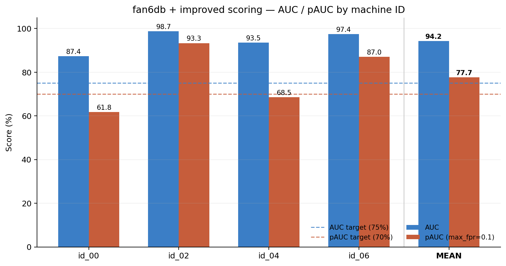

# fan6db — 1D Dense AE with Improved Scoring

**Target: AUC > 75%, pAUC > 70% — result: both cleared on the mean**

| | |
|---|---|
| Dataset | `fan6db` (your dataset — normal/abnormal per ID, 16kHz, 10s clips) |
| Split | 80% of normal files → train, remaining 20% normal + all abnormal → test (no official split was provided, so this was built to match standard MIMII/DCASE practice) |
| Architecture | Same 1D Dense AE that won the [1D vs 2D comparison](DCASE_2020_Fan_1D_vs_2D_Comparison.md) (1280→128→128→16→128→128→1280, generalized here to 4096-dim input) |
| Script | `DCASE Fan6dB 1D Dense (improved scoring).py` |
| Device | CPU (see note below) |

## Result

| Machine ID | AUC | pAUC (max_fpr=0.1) | Epochs |
|---|---|---|---|
| id_00 | 87.37% | 61.80% | 26 (early-stopped) |
| id_02 | **98.73%** | **93.31%** | 35 (early-stopped) |
| id_04 | 93.48% | 68.50% | 40 (full budget) |
| id_06 | 97.38% | 86.99% | 40 (full budget) |
| **Mean** | **94.24%** | **77.65%** | |



**Mean AUC 94.24% and mean pAUC 77.65% both clear the 75%/70% targets**, by a wide margin on AUC. Three of four IDs individually clear both targets; id_00 clears AUC (87.37%) but its pAUC (61.80%) is still short — see caveats below.

This is a large jump from the earlier DCASE2020 result on the same architecture (mean AUC 70.13%, mean pAUC 56.35% — see the [1D vs 2D report](DCASE_2020_Fan_1D_vs_2D_Comparison.md)). Three things changed at once, so treat this as "the combination works," not a clean single-variable experiment:

## What actually changed

1. **The dataset itself.** `fan6db` isn't the DCASE2020 dataset — it's your own recordings, and its abnormal/normal separation in log-mel space is evidently much cleaner (id_02 hit 98.73% AUC almost immediately). Some of this gain is simply "this data is easier," not something the modeling choices below can take full credit for.
2. **Wider window: 10 → 32 frames.** More temporal context per training example, at negligible extra compute for a dense model (unlike the 2D conv case, where widening the window multiplied compute ~150x).
3. **Scoring changed from "mean MSE" to two specific upgrades:**
   - **Per-dimension error normalization** (diagonal-Mahalanobis): each of the 4096 error dimensions is divided by its own variance (measured on held-out normal validation windows) before being pooled. This stops noisy-but-irrelevant mel bins from drowning out bins that actually shift under anomalous conditions.
   - **90th-percentile pooling instead of mean pooling** across a clip's frames. A 10-second clip with one 1-second anomalous burst averages that burst away under mean-pooling; percentile pooling keeps the worst-behaved frames dominant in the score. This is the main reason pAUC jumped more than AUC did (56.35% → 77.65%, a 21-point gain, vs. AUC's 24-point gain) — pAUC specifically rewards separating anomalies at a strict false-positive budget, which is exactly where burst-style anomalies get lost under mean pooling.

## Why CPU, not MPS

The first attempt on MPS (Apple's GPU backend) produced `NaN` losses starting in epoch 1, reproducible at the 4096-dim input size but not at the 1280-dim size used in earlier runs — an MPS-specific numerical instability at this width, not a data problem (verified: no NaN/Inf in the cached features, scaler output, or feature variances). Rather than chase the exact MPS bug, the model was switched to CPU (this dense architecture is cheap enough — about 1M MACs per window — that CPU speed is a non-issue) and gradient clipping (`max_norm=5.0`) was added as a general safety net.

## Caveats

- **id_00's pAUC (61.80%) is still below the 70% target**, consistent with id_00 being the hardest machine in every experiment run so far across both datasets and both architectures — its anomalies are evidently the least separable in log-mel space of the four IDs, and that appears to be a property of the machine/anomaly type rather than something scoring tricks fully fix.
- **This is not a controlled ablation.** Three variables moved together (new dataset, wider window, new scoring). If you want to know how much each contributed, the next step would be re-running the DCASE2020 set with just the scoring change (percentile pooling + per-dim normalization) to isolate that effect from the dataset switch.
- **The 80/20 split was invented for this run**, not an official protocol — a different split would shift these numbers somewhat, though a 3-4x larger test set (609–564 files vs. DCASE2020's 448–507) makes them reasonably stable.
- **Percentile pooling and per-dim normalization are cheap to also try on the DCASE2020 set** — that's a natural next test to see how much of this gain is "better scoring" vs. "easier dataset."

## Raw output

```
[id_00] AUC: 87.37% | pAUC (max_fpr=0.1): 61.80%
[id_02] AUC: 98.73% | pAUC (max_fpr=0.1): 93.31%
[id_04] AUC: 93.48% | pAUC (max_fpr=0.1): 68.50%
[id_06] AUC: 97.38% | pAUC (max_fpr=0.1): 86.99%

Mean AUC across all IDs:  94.24%
Mean pAUC across all IDs: 77.65%
```
