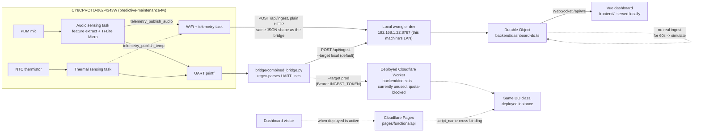

# Architecture

How this system actually works today, not how it's planned to work. See
`docs/PROGRESS.md` for the timeline of how it got here, and this file's
"Known gaps" section for what's built but not yet connected end-to-end.

## One-paragraph summary

A PSoC 6 board (CY8CPROTO-062-4343W) runs one firmware image that senses
both machine sound (via its PDM microphone) and temperature (via an NTC
thermistor), scores both for anomalies on-device with a TFLite Micro
autoencoder, prints results over UART, and - as of 2026-09-09 - also sends
them directly over WiFi. There are now two independent ways readings reach
the dashboard: the board's own WiFi telemetry task POSTing directly, and a
Python bridge script reading the same UART output and forwarding it over
HTTP - both POST to the *same* `/api/ingest` route in the *same* JSON
shape, they just take different paths to get there (see "Data flow"
below). **The currently-active backend is a local `wrangler dev` server on
this machine's LAN** (`192.168.1.22:8787`), not the deployed Cloudflare
Worker/Pages - the deployed backend hit its Durable Object free-tier quota
twice, so local dev is what's actually being used and demoed against right
now (see `docs/PROGRESS.md`'s 2026-09-09 "Pivoted active dev to local"
entry). The Cloudflare Worker + Pages split described in "Cloud backend"
below is still real and still deployed, just not the live target at the
moment.

## Data flow (today)

Both `WORKER` and `PAGES` run the exact same route logic (`backend/app.ts`'s
`createApp()`) - they're two independently-deployed entry points to the one
Durable Object, not two different backends.

## Hardware

- **CY8CPROTO-062-4343W** — the one board actually in active use. Runs
  `predictive-maintenance-fw`
  (`C:\Users\anepf\ModusToolbox-Projects\thermal-monitor-fw`), which fuses
  audio and thermal sensing on one image per the system PRD's original M1
  milestone. Has exactly one onboard LED (`CYBSP_USER_LED`), which is
  shared between the anomaly indicator and the WiFi connection-status
  blinker (see "Firmware" below for how that's arbitrated).
- **CY8CKIT-062S2-AI** — an earlier, audio-only firmware target
  (`fan-anomaly-detector-fw`,
  `C:\Users\anepf\ModusToolbox-Projects\fan-anomaly-detector-fw`), built
  and verified before the project moved to the combined board. Not part of
  the current active demo.

## ML pipeline

1. DCASE-style fan sound recordings + measured temperature go in via the
   scripts in the repo root (`prepare_features.py`,
   `train_autoencoder*.py`), producing a Keras autoencoder per machine ID
   (`id_00`, `id_02`, `id_04`, `id_06`).
2. `tools/convert_models.py` (DeepCraft model converter) quantizes each to
   int8 TFLite and emits C headers into `tools/generated/id_XX/` -
   `*_model_data.c/.h` (the model bytes) and `*_params.h` (per-ID
   threshold + per-feature error std, used at inference time).
3. Firmware picks up a specific ID via a small shim header
   (`models/id_00/active_model.h`) that just re-exports the generated
   symbols under fixed names the rest of the firmware includes.
4. On-device: PDM DMA capture → hand-ported feature extraction (Hamming
   window, CMSIS-DSP FFT, HTK mel filterbank, log/clip, frame stacking -
   mirrors the Python training pipeline exactly) → TFLite Micro int8
   inference → reconstruction-error scoring against a rolling window,
   compared to the per-ID threshold from `*_params.h`.
5. Thresholds don't transfer between microphones/rooms (the scoring
   doesn't normalize input loudness) - `id_00_params.h`'s threshold was
   recalibrated specifically for the CY8CPROTO board's own mic by
   capturing live samples and taking their 95th percentile. Re-recalibrate
   the same way if the mic, gain, or room changes.

## Firmware architecture (predictive-maintenance-fw)

Runs FreeRTOS with these tasks (see
`C:\Users\anepf\ModusToolbox-Projects\thermal-monitor-fw\main.cpp` and
`wifi/`):

| Task | Priority | Does |
|---|---|---|
| `sensing_task` | 3 (highest) | Everything the original bare-metal superloop did: `service_audio()` (DMA-driven, TFLite Micro inference, scoring), `service_thermal()` (1/s NTC read, rate-of-change check). Untouched by the WiFi work except two one-line `telemetry_publish_*()` calls where scores are already computed. |
| `wifi_conn_task` | 2 | `wifi_task.c` - connects using stored/placeholder credentials, exponential backoff on failure, auto-reconnects on drop. |
| `wifi_led_task` | 1 | Blinks the shared LED for connection status while not connected; yields it back to the sensing code's anomaly display once connected. |
| `uart_cmd_task` | 1 | `wifi_creds.c` - parses `wifi_set <SSID> <PASSWORD>` / `wifi_show` from the debug UART. |
| `telemetry_task` | 1 | `telemetry.c` - POSTs the latest published audio/temp readings to the cloud every 5s once WiFi is connected. |

Notable constraints/decisions baked into this design:
- **One LED, two jobs**: `main.cpp` exposes `led_claim_for_wifi()` /
  `led_yield_to_sensing()` so `wifi_led_task` and the existing anomaly
  indicator arbitrate ownership of the single physical LED instead of
  fighting over it.
- **Credentials persist across reflashes**: `wifi_set` writes to the very
  last row of internal flash (CRC-checked on read), well past the linked
  image's end (confirmed: image ends ~19KB before it). Falls back to an
  obvious placeholder SSID if nothing's ever been saved.
- **SysTick belongs to FreeRTOS**: the old bare-metal build used a
  hand-installed `Cy_SysTick_Init()`/`Cy_SysTick_SetCallback()` for the
  thermal sample-interval timer. Under FreeRTOS, SysTick is reserved
  exclusively for the RTOS's own scheduler tick on Cortex-M - the thermal
  timer now uses `xTaskGetTickCount()` instead. (This was a real bug,
  found and fixed on real hardware - see `docs/PROGRESS.md`'s 2026-09-09
  entry.)

## Cloud backend (`web-dashboard/backend/` + `web-dashboard/pages/`)

One Hono app (`backend/app.ts`'s `createApp()` factory), one Durable Object
class (`backend/dashboard-do.ts`, `DashboardState`, always addressed via
`idFromName("global")` - single global instance, not per-device), deployed
as **two separate Cloudflare projects** that both point at that same DO:

| | Worker (`backend/`) | Pages (`pages/`) |
|---|---|---|
| Deploy command | `npm run deploy` (`wrangler deploy`, reads `wrangler.jsonc`) | `npm run pages:deploy` (`wrangler pages deploy --cwd pages`, reads `pages/wrangler.jsonc`) |
| Live URL | `demo-kit-dashboard.anepfadhli5.workers.dev` | `demo-kit-dashboard-pages.pages.dev` |
| Owns the `DashboardState` DO class | **Yes** - `export { DashboardState }` in `backend/index.ts` | No - Pages projects can't define new DO classes at all |
| Binds to the DO | Directly (`durable_objects.bindings`, no `script_name`) | Cross-script (`durable_objects.bindings` + `script_name: "demo-kit-dashboard"`, resolves to the *same* namespace ID) |
| Route logic | `createApp()` + `app.all("*", ...)` ASSETS fallback | `createApp()` via `hono/cloudflare-pages`'s `handle()`, in `pages/functions/api/[[path]].ts` (static files served automatically by Pages otherwise) |

The Worker has to stay deployed and up to date for the Pages project's
binding to resolve at all - Pages doesn't "absorb" the DO, it just points
at wherever the Worker currently has it running. Both entry points serve
identical routes:

- `GET /api/ws` → upgrades to WebSocket, proxied straight to the DO.
- `POST /api/ingest` → validates `{channel: "sound"|"temperature"|"power",
  value, flag, threshold, unit, extra?}`, optional Bearer
  `INGEST_TOKEN` auth, calls `DashboardState.ingest()`. **Only the Worker
  has `INGEST_TOKEN` set as of now** - see "Known gaps".

Inside the Durable Object:
- State lives in memory (`latestMem`/`historyMem` Maps), not re-queried
  from SQL per tick - an earlier version's `SELECT ... LIMIT 300` on every
  broadcast blew through the free tier's daily SQL-row-read quota (see
  `docs/PROGRESS.md`). SQL is write-mostly now: one `INSERT` per reading
  for durability, a full read only once in the constructor to rehydrate
  after a cold start.
- A per-channel simulated signal generator (`simulateTick()`) keeps the
  dashboard visibly live even with nothing feeding it. A channel that gets
  a real `ingest()` call stops being simulated for `REAL_DATA_GRACE_MS`
  (60s), so a bridge can come online one channel at a time without
  fighting the simulator - this is why the dashboard can look "live" even
  when no board is connected.
- Every `recordAndBroadcast()` pushes to every open WebSocket
  (`ctx.getWebSockets()`, hibernation API - connections survive the DO
  going idle).

## Frontend (`web-dashboard/frontend/`)

Vue 3 + Vite, two routed pages (`pages/EnergyMonitoring.vue`,
`pages/PredictiveMaintenance.vue`), one shared reactive store
(`lib/live-state.js`) holding a single WebSocket connection to `/api/ws`
that both pages read from. No REST polling - `connectLiveState()` opens the
socket once, handles the initial `{type: "snapshot"}` message and every
subsequent `{type: "update", channel, reading}` message, and reconnects
with exponential backoff (same 1s→...→30s pattern as the firmware's own
WiFi reconnect logic, coincidentally) if the socket drops.

## Board → cloud bridge (`bridge/`)

`combined_bridge.py` (the one actually in use - `thermal_bridge.py` and
`sound_bridge.py` are its single-signal predecessors, kept for reference)
opens the board's UART, regex-matches each printed line against the
firmware's two line shapes (`temp=...` / `score=...`), and POSTs each
match to `/api/ingest` in the shape the Worker expects. Defaults to
`--target local` (`http://localhost:8787/api/ingest`, needs `npm run
backend:dev` running) rather than the deployed Worker, because the
deployed instance hit its Durable Object free-tier quota once already;
switch to `--target prod` (needs `INGEST_TOKEN`, from the env var or
`web-dashboard/ingest-token.local`) once that's not a concern.

## Known gaps (built but not yet connected)

- **The firmware's own WiFi telemetry doesn't reach the dashboard.**
  `telemetry.c` POSTs to `/api/readings` with a `{device_id, reading_type,
  value, is_anomaly}` shape - the Worker only implements `/api/ingest` with
  a different `{channel, value, flag, threshold, unit, extra}` shape (see
  above). These were built as two intentionally separate things (per the
  WiFi task's own spec: "don't implement any dashboard/backend/receiving
  side - that's a separate project"), but as of now nothing serves
  `/api/readings` - a request there 404s. Wiring them together (either add
  an `/api/readings` route to the Worker, or change the firmware to POST
  `/api/ingest`'s shape instead) is unstarted.
- **The firmware's WiFi has never joined a real network.** It's only been
  verified against a nonexistent placeholder SSID (correctly retrying with
  exponential backoff). Needs `wifi_set <SSID> <PASSWORD>` over UART with
  real credentials to actually test the HTTPS POST path end-to-end.
- **`fan-anomaly-detector-fw` (the CY8CKIT-only audio firmware) is not
  connected to anything** - it predates the combined-board design and
  isn't part of the current data flow.
- **The Pages deployment's `/api/ingest` has no `INGEST_TOKEN` set** - only
  the Worker does. Anyone can POST fake readings to
  `demo-kit-dashboard-pages.pages.dev/api/ingest` right now.
  `wrangler pages secret put INGEST_TOKEN --project-name
  demo-kit-dashboard-pages` (run from `web-dashboard/pages/`) needs to be
  run interactively to fix this - see `docs/PROGRESS.md`'s 2026-09-09
  "later" entry for why it wasn't done automatically.
- **The Pages↔DO cross-script binding has never been exercised by a
  successful live request.** It's confirmed *configured* correctly (same
  `namespace_id` as the Worker's own binding, checked via the Cloudflare
  API), but every attempt to actually call it hit the account's Durable
  Object free-tier quota mid-verification (see `docs/PROGRESS.md`) before
  a real read/write could complete. Re-verify with one clean request once
  the quota resets, rather than assuming it works.
- **`wrangler pages dev` can't be used to locally test the Pages↔DO
  binding** - cross-script Durable Object binding resolution in local dev
  is a known-flaky/experimental area of Wrangler; it errors even with the
  Worker's own `wrangler dev` running alongside it. `pages:dev` (see
  `package.json`) is only useful for testing the static frontend and
  non-DO routes locally; anything DO-related needs an actual deploy to
  verify.
